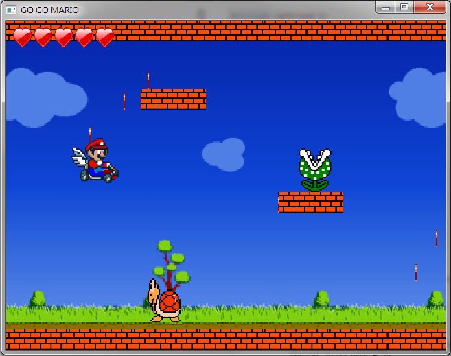
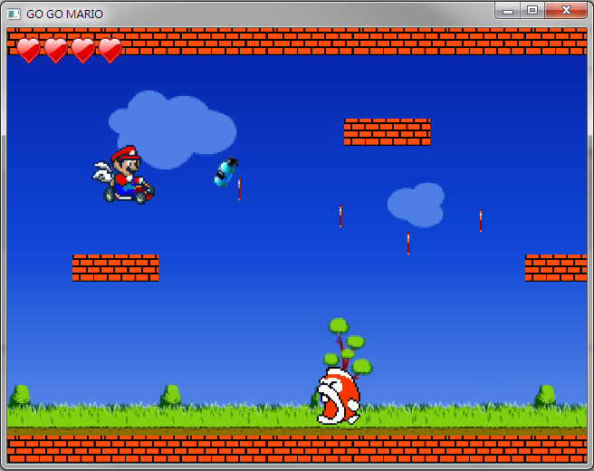
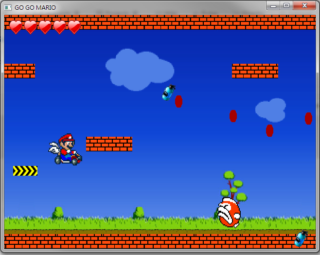

## 跑跑馬力歐 GoGoMario
A simple 2D side-scrolling game developed using OpenCV & OpenGL.

### 功能
1. 橫向卷軸遊戲，主角馬力歐自動向右移動。
2. 按空白鍵會改變上下方向。
3. 馬力歐總共有6個生命，遊戲畫面左上角會顯示備用的生命。
4. 路上會有牆壁跟怪物，碰到牆壁跟怪物生命都會-1，生命歸零就死了，會跳出死掉畫面。
5. 玩家控制馬力歐方向可以吃金幣，每吃一個金幣分數就+1。
6. 路上會有道具"加速器"，碰到加速器橫向卷軸的移動速度會增加。
7. 路上會有道具"氮氣"，吃到氮氣可以存在道具欄，按下"Z"鍵可以使用，可以讓馬力歐短暫加速。
8. 道具欄在遊戲畫面右下角，會顯示目前持有的道具，道具欄只有一格，吃到新道具舊道具就會自動丟棄。
9. 遊戲過關需要吃到一定數量的金幣，若地圖走完沒吃夠金幣，會跳出未過關畫面，若有吃夠金幣，則跳出遊戲過關畫面。
10. 馬力歐跟怪物本身都有動畫。

### 遊戲畫面

